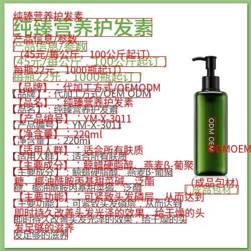

# libocr.axera
base ppocr_v5

---
## Build Instructions

### x86 Build

```bash
git clone https://github.com/AXERA-TECH/libocr.axera.git
cd libocr.axera
sudo apt install libopencv-dev build-essential 
./build.sh
```

### AArch64 Build

#### Cross-compile for aarch64

```bash
git clone https://github.com/AXERA-TECH/libocr.axera.git
cd libocr.axera
./build_aarch64.sh
```

#### Native Build on Target Board

```bash
git clone https://github.com/AXERA-TECH/libocr.axera.git
cd libocr.axera
sudo apt install libopencv-dev build-essential
./build.sh
```
---

## Get Model
[PPOCR_v5](https://huggingface.co/AXERA-TECH/PPOCR_v5)

## Usage Example
```shell
./test_ocr --det ../models/ax650/det_npu3.axmodel --cls ../models/ax650/cls_npu3.axmodel --rec ../models/ax650/rec_npu3.axmodel --dict ../models/ppocrv5_dict.txt -i ../images/11.jpg -o output.jpg 
[I][                             run][  31]: AXCLWorker start with devid 0

input size: 1
    name:        x [unknown] [unknown] 
        1 x 3 x 960 x 960


output size: 1
    name: fetch_name_0 
        1 x 1 x 960 x 960

[I][                            init][  63]: input_width: 960, input_height: 960


input size: 1
    name:        x [unknown] [unknown] 
        1 x 3 x 80 x 160


output size: 1
    name: fetch_name_0 
        1 x 2

[I][                            init][  63]: input_width: 160, input_height: 80


input size: 1
    name:        x [unknown] [unknown] 
        1 x 3 x 48 x 320


output size: 1
    name: fetch_name_0 
        1 x 40 x 18385

[I][                            init][  63]: input_width: 320, input_height: 48

num_objs: 16
obj 000: num_tokens 006, text 发足够的滋养
obj 001: num_tokens 019, text 即时持久改善头发光泽的效果，给于燥的头
obj 002: num_tokens 019, text 【主要功能】：可紧致头发磷层，从而达到
obj 003: num_tokens 006, text （成品包材）
obj 004: num_tokens 014, text 糖、椰油酰胺丙基甜菜碱、泛酯
obj 005: num_tokens 019, text 【主要成分】：鲸蜡硬脂醇、燕麦β-葡聚
obj 006: num_tokens 013, text 【适用人群】：适合所有肤质
obj 007: num_tokens 011, text 【净含量】：220ml
obj 008: num_tokens 016, text 【产品编号】：YM-X-3011
obj 009: num_tokens 006, text ODMOEM
obj 010: num_tokens 012, text 【品名】：纯臻营养护发素
obj 011: num_tokens 017, text 【品牌】：代加工方式/OEMODM
obj 012: num_tokens 014, text 每瓶22元，1000瓶起订）
obj 013: num_tokens 017, text （45元/每公斤，100公斤起订）
obj 014: num_tokens 007, text 产品信息/参数
obj 015: num_tokens 007, text 纯臻营养护发素
[I][                             run][  81]: AXCLWorker exit with devid 0
```


## Community
QQ 群: 139953715
